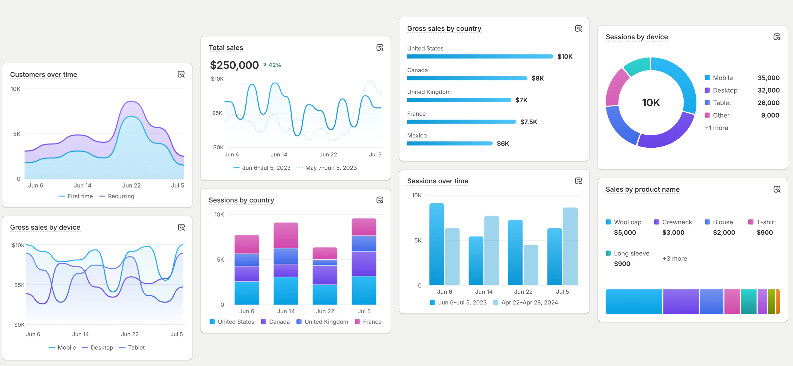
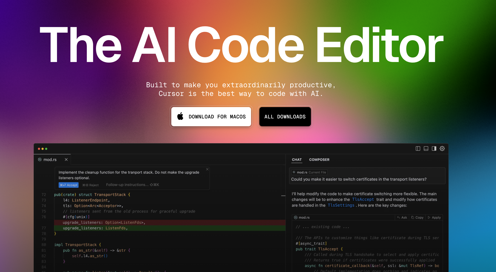

# Level up your efficiency using Cursor 🚀

---

## Survey

<!-- How many of you have used some kind of AI for answering question? GPT, or Meta or Gemini? -->
<!-- How many of you use Cursor or any other AI Code Editor? -->
<!-- How many of you have tried some kind of AI tool to help you write code? -->
<!-- How many of you think that AI is going to take your job? -->

---


<style scoped>
* {
  text-align: left;
}
</style>

## About Me

Software Engineer @ Shopify

---

<style scoped>
    img {
        margin-left: -70px;
        margin-top: 50px;
    }
    </style>

<br />

## Analytics Team

`Data -> Insights -> Actions`

<small>

Complex → Simple

</small>



---

## Gather context quickly

How do we best use AI to understand the "what/how/why" of our code?

<!-- It's important to understand that AI is not a silver bullet. It's a tool that can help us, but it's not a replacement for the skills and knowledge of a developer. It's fascinating to see that everything that can be generated by AI from top up. But I see it as a tool that is best served (at least at this moment) to help us be more efficient in the way that we understand the code, rather than the actual code generation. Although that's pretty cool too! -->

---



---

## Quick Cursor Facts

VSCode fork
Cursor Tab (Copilot)
Cursor Composer (Copilot Edit)

<br />

`Data -> Insights -> Actions`

---

# Getting to know a new Codebase

Before 🐢
vs
After 🚀

---

<style>
  footer {
    font-size: 30px;
  }
</style>

<!-- footer: `Data` → Insights → Actions-->

## Structured Prompt

```
Analyze the data flow in this file:
1. Entry: List all user interactions and API calls
2. State: Track how the data changes through each step
3. Dependencies: Map external service calls and component dependencies
4. Output: Show where data is rendered or sent
```

---

## .cursorrules

Give the AI Editor its own context to follow

---

<!-- footer: Data → `Insights` → Actions-->

## Mermaid Diagram

```
Analyze the data flow in this file:
1. Entry: List all user interactions and API calls
2. State: Track how the data changes through each step
3. Dependencies: Map external service calls and component dependencies
4. Output: Show where data is rendered or sent
```

```
Generate a mermaid diagram and highlight any potential bottlenecks.
```

---

## GitBlame & History

Using Github CLI to get the commit history and blame in combination with Cursor.

<!--

git blame -L 728,753 packages/form-core/src/FormApi.ts | \
while read -r line; do
  sha=$(echo $line | awk '{print $1}')
  {
    echo "$line"
    echo "PR Info for $sha:"
    gh pr list --search "$sha" --state merged --json number,title,body --jq '.[] | "PR #\(.number): \(.title)\nDescription: \(.body)\n"'
    echo "-------------------"
  }
done | pbcopy

-->

---

<!-- footer: Data → Insights → `Actions`-->

## Combine them all

Use Composer to generate a new feature/tool

<br />

Complex → Simple

---

<!-- footer: <span></span> -->

## Hype Cycle

<!-- So maybe you've tried or have been meaning to try to use AI to help you write code, but you've been hesitant or dissapointed with the results -->


---

> We become better engineers by embracing and furthering technology, moving ourselves up the stack of abstraction, allowing us to become far more productive than we ever thought possible. We need to be _optimistic_ about the future of technology, not _cynical_. There is no better time to be alive.

<br />

<small>

James Stanier
Director of Engineering @ Shopify

</small>

---

### Thank you!

@snesjhon
